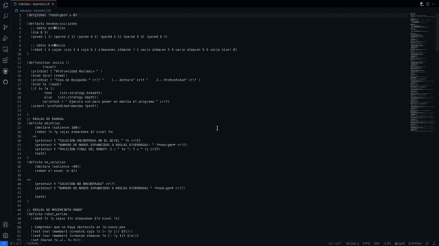

# CLIPS IDE

The **CLIPS IDE** extension provides an IDE-like experience for the [**CLIPS**](http://www.clipsrules.net/) programming language inside Visual Studio Code.

## Features

### Terminal

Improved terminal experience over the _CLIPS REPL_ by including several features:

- Command Editing (moving, removing characters, etc.)
- Command History (`up/down arrow keys`)
- Clear Line (`Ctrl+U`) and Clear Screen (`Ctrl+L`)

### Views

- Facts
- Agenda
- Instances

These views update their state automatically after each command.

## Extension Settings

This extension contributes the following settings:

- `clips.defaultEnvironmentViews`: Selection of which views should be opened whenever the `Open CLIPS Environment` command is used (the `facts` and `agenda` views are enabled by default).
- `clips.logLevel`: Sets the log level for the extension (`off` by default). Only useful for _testing/debugging_ purposes.

## Known Issues

This extension does not work properly on Windows, which is probably caused by a bug in the *node_pty* library I have not been able to troubleshoot.

## Release Notes

### 1.0.3

Fixed - Error message was not being shown when the CLIPS terminal failed to spawn.

Found issue - The CLIPS terminal does not spawn on Windows, even if the path is correct.

### 1.0.2

Fixed - Views not updating when they were hidden in a tab and then selected.

### 1.0.1

Improved the system that makes views close when CLIPS is closed.

(It is not perfect due to VSCode limitations, but it now works in more cases than before.)

### 1.0.0

Initial release of CLIPS IDE.
